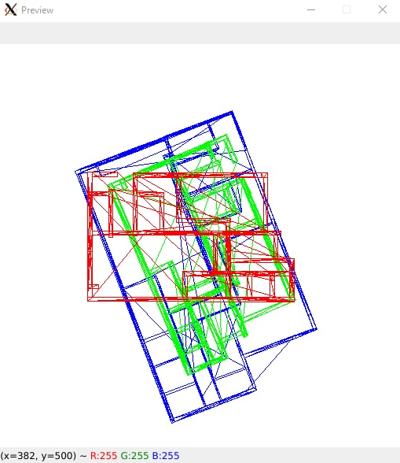
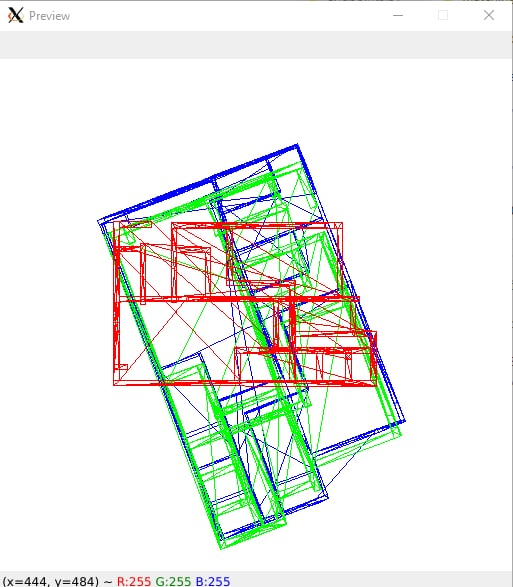
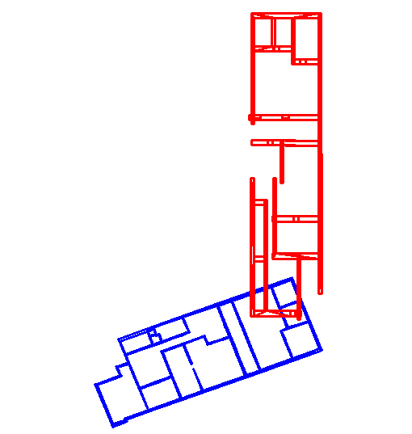
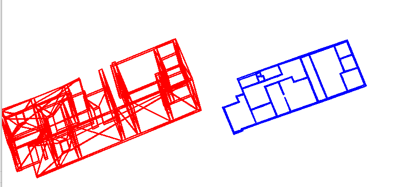

# Experiments Notes

## 4/2/2022 - Matching

RigidRegistrationnoScale matching method was applied. The rotation of the target model is pretty close to the source CAD model, but its scale is not enough.

On the picture:
- Blue - ground-truth model.
- Red - predicted model.
- Green - rotated and translated model with the matching algorithm.



RigidRegistration from pycpd library solved the problem with scale.




## 4/2/2022 - Matching

``` python
# Source variables
gt_normalized -> ground-truth V3 matrix: [..., [x, y, z]]
tg_normalized -> target (user) V3 matrix: [..., [x, y, z]]

# Matching algorithm
# From: https://github.com/SMRT-AIST/fast_gicp
gicp = pygicp.FastGICP()
gicp.set_input_target(gt_normalized)
gicp.set_input_source(tg_normalized)
matrix = gicp.align()

Matrix: 
 [[ 0.37804806 -0.925188   -0.03326851 -0.00805712]
 [ 0.9175803   0.37922916 -0.11929626 -0.00814763]
 [ 0.12298786  0.01457319  0.99230117 -0.00360233]
 [ 0.          0.          0.          1.        ]]

matrix[:3, :3] -> rotation matrix
matrix[:3, 3] -> translation vector

# Transformation formula
x, y, z = np.dot(matrix[:3, :3], np.array([x, y, z])) + matrix[:3, 3]
```

Transformation has been applied to the `facility` model.

Top-down view of a user's (red) prediction and ground-truth (blue) model.



Matrix transformation output:



### Reproduce:

```bash
cd python
python main.py match ../data/test/Annex/22_Annex_01_f01_3dmodel.dxf ../data/users/Annex/22_Annex_01_F1_s0p01m.dxf
```